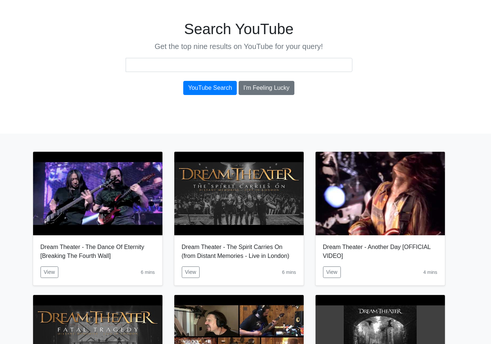

# Youtube Api

## 

**First Steps**

- python3 -m venv venv (eu coloco venv novamente por padrão)
- source venv/bin/activate 
- pip3 install -r requirements.txt

- python3 manage.py runserver

## Have Fun =) 

